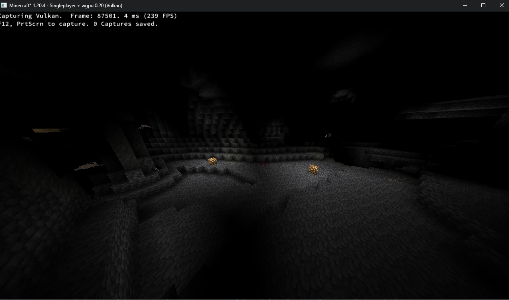

# wgpu-mc

## 🚀 A blazing fast alternative renderer for Minecraft
### Discord
https://discord.gg/NTuK8bQ2hn
### Matrix
https://matrix.to/#/#wgpu-mc:matrix.org

#### Intro

`wgpu` is a crate implementing the WebGPU specification in Rust. It's primary backends are Vulkan, DirectX 12, and Metal.

#### Goals

wgpu-mc is a standalone, mostly-batteries-included rendering engine written in Rust.
Electrum is a fabric mod that integrates wgpu-mc with Minecraft.

#### Current status

Both the engine and Electrum are both currently under active development.
wgpu-mc is fairly mature, while Electrum is more WIP.

#### Screenshots

8/25/23

#### WIP Features

The features listed below are not necessarily fully complete and
may still be bugged

Engine

- [x] Block models from standard datapacks
  - [x] Multipart
  - [x] Variants
- [x] Terrain rendering
- - [ ] Translucency sorting
- - [x] Frustum culling
- - [x] Lighting (AO + block/sky light)
- [x] Instanced Entity Rendering
- [x] Animated textures
- [ ] Mipmaps  
- [x] Data-driven shader graph

Minecraft

- [x] GUI rendering
- [x] Terrain rendering
    - [x] Lighting integration
    - [x] Chunk updates
- [ ] Entities
- - [x] Instancing (one draw call per entity type)
- - [x] Model upload (Models are correctly translated dynamically from Minecraft's format into the wgpu-mc entity struct format)
- - [ ] Player atlas
- - [ ] Textures (Somewhat working, UVs are bugged)
- [ ] Item rendering
- [ ] Implement FRAPI/FREX
- [ ] Particles